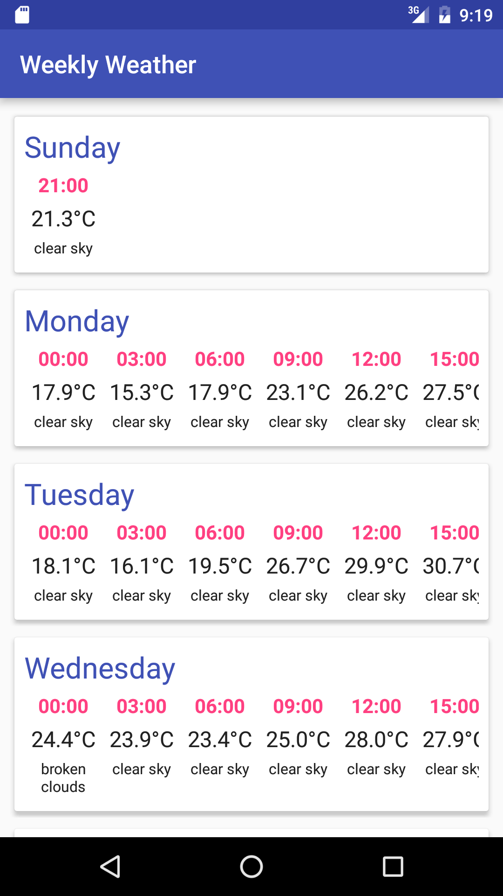

# weekly-weather

A short Android sample app using the [Open Weather Map API](http://openweathermap.org/forecast5), [RxJava](https://github.com/ReactiveX/RxJava), [Dagger 2](http://google.github.io/dagger/) and Card Views.

## Building

Edit your Global Gradle properties file `~/.gradle/gradle.properties` and add the variable `WeeklyWeatherApiKey` with your Open Weather Map API key, e.g.:

    WeeklyWeatherApiKey="xxxxxxxxx"

Build:

    ./gradlew build

Run:

    ./gradlew installDebug

Test:

    ./gradlew test

